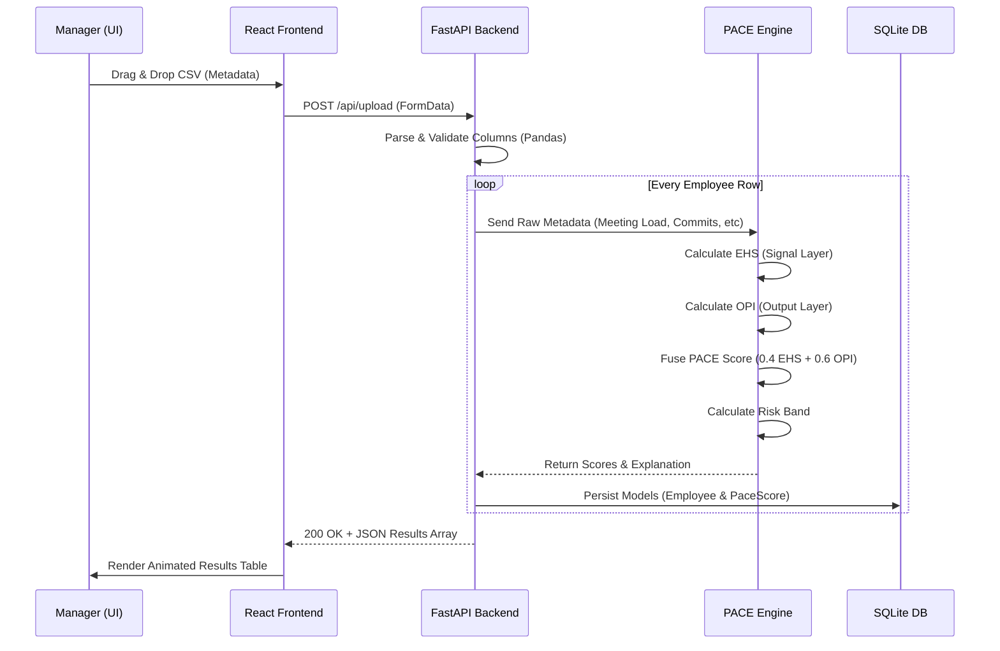

# EngageIQ: Under the Hood (Phases 1 & 2)

Welcome to the technical breakdown of the EngageIQ Platform. This presentation document showcases the workflow from raw data ingestion to dashboard visualization, explaining exactly what has been built and how the algorithms work.

---

## 1. What We've Built (MVP - Phases 1 & 2)

We have successfully implemented the foundation and core processing logic of the EngageIQ Platform. 

- **Frontend (`engageiq-frontend`)**: A modern React/Vite application utilizing a highly customized CSS Variable theme system for seamless Light/Dark mode transitions, glassmorphism aesthetics, and premium UI components. 
- **Backend (`engageiq-backend`)**: A robust Python FastAPI engine connected to a SQLite database.
- **Data Ingestion (File Handling)**: A secure UI component enabling managers to upload historical work metadata via CSV.
- **PACE Engine**: The core mathematical algorithms (EHS + OPI) that calculate risk bands and productivity indices in real-time.

---

## 2. The Complete Data Workflow

Here is the step-by-step journey of your data, from the moment a manager drops a CSV file into the browser, to the moment a risk band is generated.



---

## 3. What Happens Under the Hood?

### A. Data Normalization & Validation
When the CSV hits the FastAPI backend, we use `pandas` to read the file into a DataFrame. We validate that all necessary columns exist (e.g., `meeting_load`, `completion_rate`, `rework_ratio`). 

### B. The EHS Algorithm (Signal Layer)
**Goal:** Measure the health of work patterns and collaboration habits.
*Weight: 40% of Final Score*

The engine calculates the Engagement/Work-Pattern Health Index (EHS) by looking at:
1. **Meeting Load** (30% weight)
2. **Focus-Time Gaps** (30% weight)
3. **Response Latency** (20% weight)
4. **After-Hours Activity** (20% weight)

```python
ehs = 1 - (0.30*meeting_load + 0.30*focus_gap + 0.20*latency + 0.20*after_hours)
```
> [!NOTE]
> Since high meeting loads and high after-hours activity are *negative* signals, they are subtracted from 1 to generate a "health" score where 1.0 is perfectly healthy.

### C. The OPI Algorithm (Output Layer)
**Goal:** Measure actual delivery and tangible work outcomes.
*Weight: 60% of Final Score*

The engine calculates the Output Productivity Index (OPI) based on:
1. **Task Completion Rate** (25% weight)
2. **Sprint Velocity** (25% weight)
3. **Deadline Adherence** (20% weight)
4. **Code/Activity Volume** (20% weight)
5. **Rework Ratio** (-10% penalty weight)

```python
opi = (0.25*completion + 0.25*velocity + 0.20*deadline + 0.20*code) - (0.10*rework)
```

### D. The PACE Fusion & Risk Classification
The two indices are combined using the **Dual-Lens Model**. Output is intentionally weighted higher so employees with quieter collaboration styles are not unfairly penalized.

```python
pace = (0.4 * ehs) + (0.6 * opi)
```

Finally, the engine classifies the employee's `pace` score into a **Risk Band**:
- **Healthy**: Score >= 0.7
- **Moderate**: Score >= 0.4 and < 0.7
- **At-Risk**: Score < 0.4

---

## 4. The Data Ingestion UI 

The Data Ingestion page (`/ingestion`) was built to impress. 
- **Aesthetics**: It features a glassmorphism accent background (using the `--opi` teal variable with a massive blur filter).
- **Interactivity**: The drag-and-drop zone changes color state (`var(--opi-wash)`) when a file is hovered over it. 
- **Results Rendering**: Once the backend returns the processed JSON, an inline premium data table dynamically renders the PACE scores. Badges are color-coded (Green for Healthy, Amber for Moderate, Red for At-Risk) utilizing the custom CSS properties (`--healthy`, `--moderate`, `--at-risk`).

> [!TIP]
> You can test this entirely locally right now! Open your React app, navigate to **Data Ingestion**, and upload `sample_data.csv` found in your backend folder.

---

## Next Steps (Phases 3 & 4)
While Phases 1 and 2 successfully prove the algorithmic model and UI capability using static CSV files, the next phases will involve:
1. Building OAuth API connectors to automatically pull this data from Jira, Slack, and Google Workspace.
2. Implementing the **LSTM (Long Short-Term Memory) ML Model** to detect historical anomalies over time, replacing the current static point-in-time calculation.
